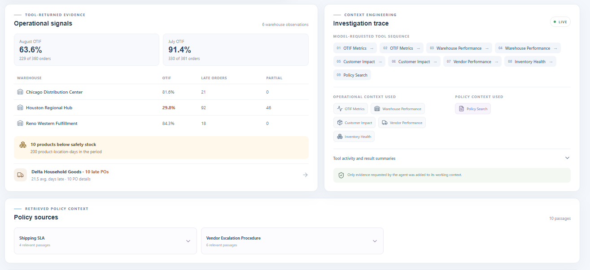
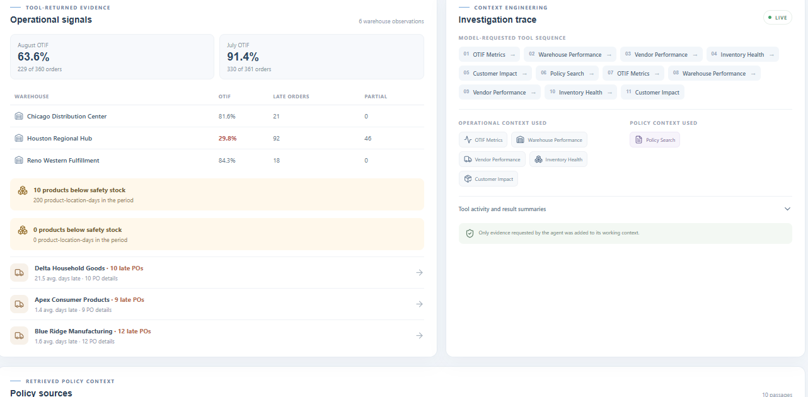
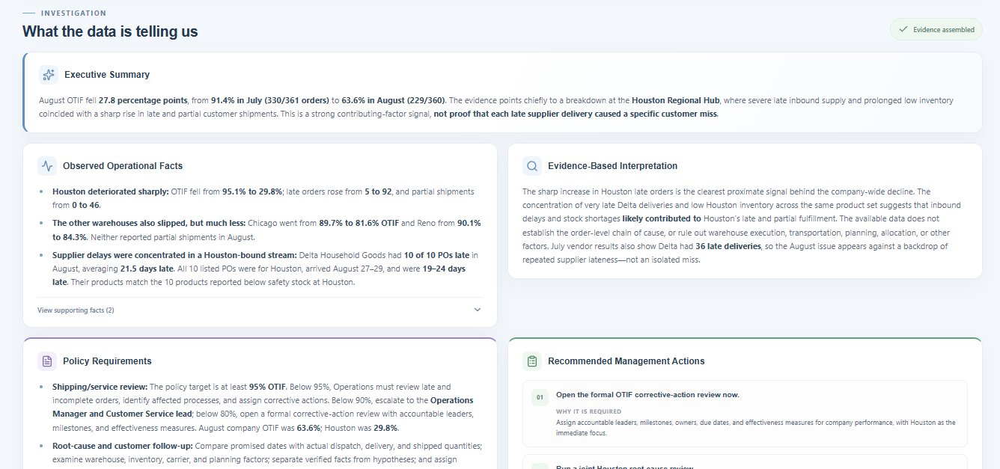

# SupplyChain AI

### Context-Aware Operations Intelligence with Agentic AI, MCP, and RAG

SupplyChain AI is a synthetic enterprise demonstration showing how an AI agent can investigate operational performance issues by dynamically selecting the business data and company-policy context required to answer a question.

The system does **not** send the entire database or policy library to the model. The agent selects governed capabilities and receives only the evidence it requests:

```text
User Question
  → AI Agent
  → Tool Selection
  → MCP
  → Operational Data / Policy Retrieval
  → Selected Context
  → Grounded Analysis
```

All business data and policies are fictional and synthetic, created solely for demonstration.

## What This Project Demonstrates

SupplyChain AI is a hands-on portfolio project demonstrating how enterprise AI systems can combine structured operational data, unstructured business policies, agentic reasoning, and governed tool access. I designed and built the solution end to end using TypeScript/Node.js, OpenAI, MCP, RAG, SQLite, embeddings, and React/Vite. Its architecture keeps deterministic business calculations separate from LLM reasoning and controls which operational facts and policy passages enter the model's working context.

**Context Engineering • Agentic AI • MCP • RAG • Tool Calling • Enterprise Data Integration Patterns • Evidence-Grounded Analysis • AI Guardrails**

## Demo

The primary demonstration question is:

> Investigate why OTIF performance declined in August 2026 and tell me what actions management should take according to company policy.

The agent can inspect order service, warehouse performance, inventory, purchase orders, vendors, customers, and retrieved policy passages. It discovers relevant locations, suppliers, products, and escalation requirements from those sources; these findings are not named in the agent instructions. It distinguishes measured results from interpretation and avoids claiming order-level causation when the data does not establish it.



*The executive dashboard brings operational KPIs together with a natural-language investigation workflow.*

## Why I Built This

This project demonstrates an architecture for applying AI to an operational question without treating the model as a database, calculator, or policy source of truth. It brings deterministic business metrics and approved written procedures together through bounded, inspectable capabilities.

The design highlights context engineering, agentic tool selection, Model Context Protocol (MCP), Retrieval-Augmented Generation (RAG), embeddings and semantic search, structured and unstructured context, evidence-grounded synthesis, enterprise guardrails, and observable tool activity. The UI exposes the evidence requests and sanitized results that informed the answer, not private chain-of-thought.

## Architecture

See [the architecture diagrams](docs/architecture.md) for the end-to-end flow and an illustrative investigation sequence.

The main layers are:

| Layer | Responsibility |
| --- | --- |
| React/Vite executive UI | Collects a question and presents the answer, evidence, policy sources, and observable investigation trace. |
| Local API | Validates the request, invokes the MCP-backed agent, and returns sanitized display metadata. It binds to loopback. |
| OpenAI Responses API agent | Chooses among discovered capabilities, routes calls, and synthesizes only returned evidence. |
| MCP client and SupplyChain MCP server | Discover and invoke the local governed capabilities over stdio. |
| Governed business tools | Validate inputs and call fixed, parameterized, read-only queries. |
| SQLite operational data | Stores the synthetic distribution-company records used by the business tools. |
| Semantic policy retrieval | Embeds section-aware Markdown chunks, searches a local vector index by cosine similarity, and returns relevant passages. |
| OpenAI embeddings | Creates document and query vectors for policy search. |
| Local vector index | Stores embeddings and chunk metadata under the ignored `data/vector-index/` directory. |

The repository also retains a direct-tool agent for comparing the application boundary without MCP. Both agent implementations reuse the existing business and retrieval capabilities.

## Context Engineering

A traditional prompt-heavy approach may send large amounts of potentially irrelevant context to a model. SupplyChain AI starts with the user’s question, instructions, and governed tool definitions. The model then requests the operational evidence and policy passages it needs. Tool results enter its working context only after those requests.

This keeps context more relevant, makes evidence provenance clearer, lowers the chance that unrelated information will influence synthesis, and separates facts, interpretation, policy, and recommendations. Tool selection is observable through the UI’s investigation trace. That trace describes tool activity and returned evidence; it does not expose private chain-of-thought.



*The trace exposes observable tool selection and retrieved policy context without exposing private chain-of-thought.*

## How the Investigation Works

1. A user asks an operational question in the UI.
2. The agent determines which capabilities could help answer it.
3. It discovers tool definitions from the local MCP server.
4. Structured business tools run fixed, read-only queries against SQLite.
5. When policy context is relevant, semantic search retrieves passages from the approved policy index.
6. Only requested tool results are returned to the model.
7. The model synthesizes observed facts, evidence-based interpretation, policy requirements, recommendations, and evidence gaps.
8. The UI displays the response with sanitized tool sequence, evidence summaries, and policy-source metadata.

## MCP

MCP was introduced to put a standard discovery and invocation boundary between an AI client and the project’s capabilities. The repository retains two useful shapes:

```text
Direct tool calling: Agent → TypeScript business functions
MCP access:          Agent → MCP client → MCP server → same TypeScript business functions
```

The MCP server is deliberately a thin adapter. It maps validated MCP requests onto existing TypeScript functions; it does not duplicate SQL or retrieval logic. Local stdio keeps this demonstration private to the machine and avoids introducing a remote service boundary prematurely.

| Dimension | Direct tool calling | MCP tool access |
| --- | --- | --- |
| Coupling | Agent is coupled to application function interfaces. | Agent depends on the MCP protocol and a server boundary. |
| Tool discovery | Usually supplied by application code. | Definitions are discovered from the MCP server at runtime. |
| Portability | Straightforward inside one application and runtime. | A compatible client can use the same server contract. |
| Complexity | Fewer processes and less protocol overhead. | Adds server lifecycle, transport, and protocol handling. |
| Reuse | Best when one application owns the tools. | Better suited to sharing capabilities across multiple compatible clients. |
| Governance | Controls can live in the application’s tool registry. | A distinct server boundary provides a place to govern and audit capability access. |
| Appropriate use | A focused application with a small, stable tool set. | Multiple clients, runtime discovery, or independently managed tool providers. |

MCP is an architectural option, not an automatic improvement for every system. Direct calls remain simpler when the capability set is local and fixed.

## RAG and Policy Retrieval

The approved policies are Markdown files in `documents/`. The loader splits them primarily by heading, further divides oversized sections while retaining heading metadata, and embeds each chunk with OpenAI’s `text-embedding-3-small` model. The vectors, text, and source metadata are stored in a local JSON vector index. At query time, the query is embedded and cosine similarity ranks the indexed passages.

Search results retain their document, section, and chunk identifiers so the response can show where policy context came from. The agent does not receive every policy document at once. Policy thresholds and procedures are taken from passages retrieved for the question rather than placed in the system prompt.

## Evidence Boundaries

The response is designed to separate:

- **Observed facts:** values returned by operational tools or quoted from retrieved policy.
- **Evidence-based interpretation:** an explanation that connects observations while making clear when it is an inference.
- **Policy requirements:** requirements supported by retrieved company-policy passages.
- **Recommended actions:** next steps tied to the evidence and, when stated as policy, to retrieved requirements.
- **Evidence gaps:** relationships or time periods the available tool results do not establish.

For the August demonstration, the data can show supplier delays, inventory shortages, and service deterioration occurring together. A delayed purchase order can be associated with its receiving warehouse, while the dataset does not directly link that purchase order to a particular customer order. The evidence can therefore indicate a plausible operational connection without proving complete order-level causation.



*The analysis separates observed facts, evidence-based interpretation, policy requirements, management actions, and evidence limitations.*

## Guardrails

- Business tools are read-only and execute parameterized database queries.
- No arbitrary SQL capability is exposed.
- Tool inputs are validated; model-provided arguments are checked against discovered schemas and existing tool validation.
- Policy retrieval is limited to the approved `documents/` directory during indexing and the local generated vector index during search.
- No user-provided file paths or arbitrary filesystem tools are exposed.
- Agent execution is capped at six tool-call rounds and 18 total calls.
- The OpenAI key is loaded server-side from `.env`; it is not returned to the UI or logged.
- Embedding vectors and private chain-of-thought are not exposed in the UI.
- The operational records and policies are fictional/synthetic.

## Technology Stack

Versions below are the declared package ranges in `package.json`; Node.js itself is a runtime prerequisite, not an npm dependency.

| Technology | Declared version | Use |
| --- | --- | --- |
| Node.js | 24+ | Runtime, built-in SQLite, and TypeScript type stripping. |
| TypeScript | `^5.9.2` | Application, agent, tools, server, and UI types. |
| React / React DOM | `^19.3.0` | Executive dashboard. |
| Vite / React plugin | `^8.3.1` / `^6.1.1` | Local frontend development and production build. |
| OpenAI Node SDK | `^7.23.0` | Responses API and embeddings. |
| OpenAI Responses API | SDK API | Agent reasoning and tool-call loop. |
| OpenAI embeddings | `text-embedding-3-small` | Policy chunk and search-query embeddings. |
| Model Context Protocol SDK | client/server `^2.1.0` | Local stdio discovery and invocation. |
| Zod | `^4.6.5` | Explicit capability input schemas and validation. |
| SQLite | Node `node:sqlite` | Local synthetic operational data. |
| Markdown | Markdown documents / `react-markdown ^10.1.0` | Policy sources and rendered answer content. |
| Local vector index | Project JSON index | Embedding vectors, chunk text, and retrieval metadata. |
| Express | `^5.2.1` | Loopback-only UI API. |
| Biome | `^2.5.14` | UI linting. |
| Lucide React | `^1.48.0` | Dashboard icons. |

## Repository Structure

```text
app/                 React/Vite dashboard
documents/           Fictional operating policies used for retrieval
src/agent/           Direct-tool and MCP-backed agent orchestration
src/context/         Markdown loading, chunking, embeddings, and search
src/database/        SQLite schema, seed, validation, and data-access queries
src/mcp/             Local stdio MCP server and validation client
src/tools/           Deterministic business capabilities and validation
src/ui/              Loopback API that connects the dashboard to the MCP agent
data/                Local SQLite database and ignored generated vector index
docs/                Architecture, design decisions, and presentation material
```

Generated database and vector-index files are local artifacts and are not included in the repository.

## Running Locally

### Prerequisites

- Node.js 24 or later and npm.
- An OpenAI API key with access to the configured Responses and embeddings models.

### Install and configure

In PowerShell from the repository root:

```powershell
npm install
Copy-Item .env.example .env
```

Set your own `OPENAI_API_KEY` in `.env`. **Never commit `.env`.** The supplied `.env.example` contains a placeholder only.

### Initialize local data and policy search

```powershell
npm run db:init
npm run db:seed
npm run db:validate
npm run rag:index
```

`db:seed` resets and deterministically reseeds the local synthetic quarter. `rag:index` reads only the approved Markdown files and calls the embeddings API to create `data/vector-index/policy-index.json`. Rebuild the index after policy-document changes.

### Start the application

```powershell
npm run dev
```

- UI: <http://127.0.0.1:5173>
- Local API: <http://127.0.0.1:5175>

Both development servers bind to loopback. The API connects to the local MCP server over stdio. A valid `.env` key and a generated policy index are needed for a complete agent investigation.

### Useful validation commands

These scripts are present in `package.json`:

```powershell
npm run typecheck
npm run build
npm run ui:lint
npm run tools:validate
npm run rag:test
npm run mcp:test
npm run agent:test
npm run agent:policy-test
npm run agent:mcp-test
```

`npm run mcp:start` starts the local stdio MCP server for an MCP-compatible client. `npm run ai:test` runs the basic OpenAI connectivity test. Agent and retrieval tests make API calls and require a valid key; `rag:test` also requires the local vector index.

## Example Investigation

**Question:** Why did OTIF performance decline in August 2026, and what actions does policy require?

**Observed finding:** The synthetic data shows a sharp warehouse-level OTIF decline alongside late supplier purchase orders, below-safety-stock inventory, and more late or partial customer shipments.

**Policy grounding:** Retrieved inventory, vendor-escalation, and shipping-SLA passages provide the relevant review, escalation, and service requirements.

**Evidence limitation:** The data associates delayed replenishment and service deterioration at the operational level, but has no direct delayed-PO-to-customer-order link. The agent should describe that as evidence-based interpretation rather than proven order-level causation.

## Implemented Capabilities

- Designing controlled AI context from governed capabilities.
- Integrating structured operational data with unstructured policy documents.
- Building deterministic business tools and exposing them through MCP.
- Using section-aware semantic retrieval for policy context.
- Orchestrating iterative tool use with request and call limits.
- Presenting evidence-aware answers with source and activity metadata.

These are properties of this demonstration, not claims about production deployment or enterprise scale.

## Future Enhancements

The following are future possibilities, not current capabilities:

- Authenticated remote MCP transport.
- Enterprise identity and role-based access control.
- Snowflake or another enterprise data warehouse.
- ERP, WMS, and service API connectors.
- SharePoint or other enterprise document sources.
- Persistent observability, answer evaluation, and automated regression suites.

## Disclaimer

All companies, customers, vendors, warehouses, operational records, incidents, and policies in this repository are fictional/synthetic and created solely for demonstration.

## Screenshots

The screenshots above are stored in [`docs/screenshots/`](docs/screenshots/). See [the screenshot guidance](docs/screenshots/README.md) for capture and content recommendations.
