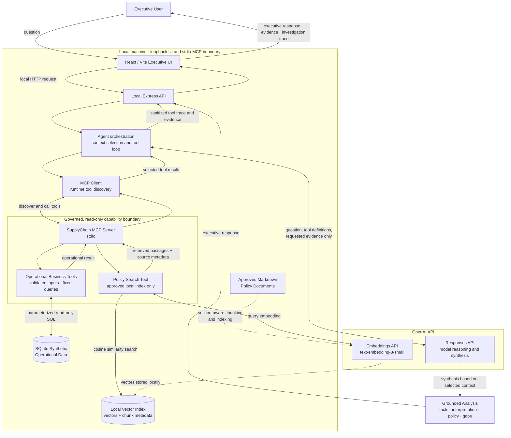
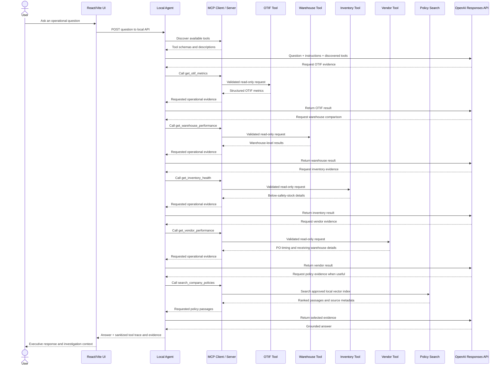

# SupplyChain AI Architecture

The diagram shows the local application boundary, the external OpenAI model services, and the two governed data paths. Agent orchestration and MCP tool access run locally. Model inference and embedding generation use the OpenAI API. The MCP server is private to the local process and communicates with its clients over stdio.

## System architecture

The OpenAI API receives the question, instructions, discovered tool definitions, and only the tool results requested during the investigation. It does not receive the full SQLite database or policy library. API credentials remain server-side. SQLite, policy files, the generated index, and the MCP stdio process stay on the local machine.

The policy index is generated from the approved `documents/` directory. At query time, the search tool embeds the query, compares it with stored vectors by cosine similarity, and returns selected text and source metadata. Embedding vectors are not returned to the UI.

## Illustrative investigation sequence

This sequence illustrates one possible August OTIF investigation. It is not a fixed workflow: the model may request a different tool, request several tools in a round, or omit policy search depending on the question and evidence already returned.

The MCP layer is an adapter around existing TypeScript capabilities. SQL and retrieval logic remain in their existing application layers rather than being reimplemented in the protocol server.
